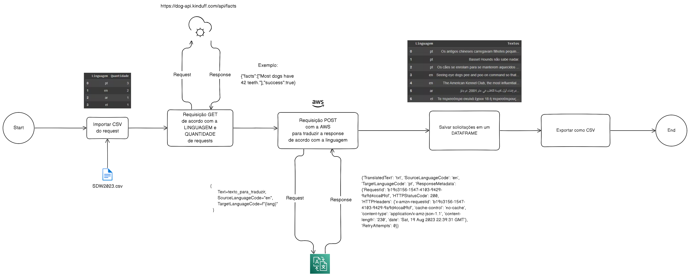

# SDW_ETL

Prática Pipeline de API junto com ETL feita no Bootcamp Santander ' Ciência de Dados com Python'
## Extract, Transform e Load

Acesse rapidamente o jupyter notebook clicando [Aqui](https://github.com/Lipeira/SDW_ETL/blob/main/Api_Test.ipynb)

## Foto schema:

